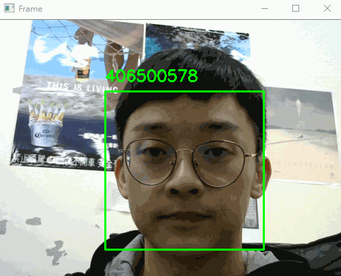

## 手動收集臉部影像資料集
#### 介紹
在做任何影像辨識前都會經歷收集資料集、訓練才能辨識，一般網路上的教學會使用已收集好的資料集來辨識物品，不過我們往往是想要一個符合自己需求、能辨識自己想辨識的資料集。為了做到客製化的臉部辨識，我們必須手動收集影像來完成資料集的製作，這個步驟也稱做「臉部辨識註冊」（facial recognition enrollment）。我們稱之為「註冊」是因為在這個過程中，我們會將使用者註冊、登記為我們的資料集和應用中的一個真人樣本。<br>
#### 使用方式
0. 先將所需要的套件裝好
   ```bash
   pip install imutils opencv-python face_recognition
   ```
1. 建立自己學號的資料夾，並使用以下指令開啟攝影機開始做影像收集：
   ```bash
   python build_face_dataset.py --cascade \
   haarcascade_frontalface_default.xml --output dataset/這裡放你的學號
   ```
   影像串流開啟之後，在適合的影格上按 `k` 來儲存，<i><b>多換幾個角度、遠近，盡量避免重複且一致的影像</b></i> 才能確保辨識的準確度。<br><br>

2. 待所有組員都有自己的資料集後，使用此指令製作已知臉部編碼pickle檔：
   ```bash
   python encode_faces.py --dataset dataset --encodings \
   encodings.pickle --detection-method hog
   ```
   【備註】用 `hog` (方向梯度直方圖) 訓練比較快但準確度較低，若有GPU可以用或是可以在筆電/桌機/雲端上訓練的話可以選用 `cnn` (卷積神經網路) 的方式訓練。<br><br>

3. 要執行辨識的話，請用以下指令：
   ```bash
   python pi_face_recognition.py --cascade haarcascade_frontalface_default.xml \
	--encodings encodings.pickle
   ```
#### 如果成功的話就會像這樣唷！ 🤳
<table>
<tr><td>

</td></tr>
</table>

#### 參考資料
- [連結一](https://www.pyimagesearch.com/2018/06/11/how-to-build-a-custom-face-recognition-dataset/)
- [連結二](https://www.pyimagesearch.com/2018/06/25/raspberry-pi-face-recognition/)