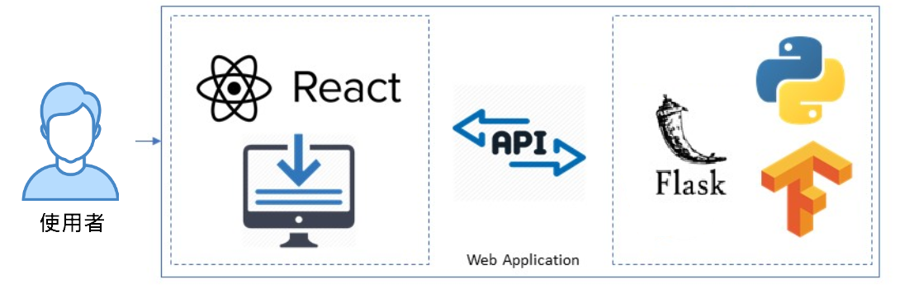

---
### 使用方法
1. 先確定電腦裡有node.js，若沒有請至[這裡](https://nodejs.org/zh-tw/download/)下載
2. 使用`git clone https://github.com/tkue521/tkuim`將此專案下載到電腦裡，再使用powershell或是terminal進到`03-團體辨識`這個資料夾裡。
3. 這裡面分成兩個伺服器，一個是負責網頁的、另一個是負責做影像辨識的。
    - **前端**：打`npm install`把前端所需要的框架、套件都裝起來，裝好後用`npm start`將網頁伺服器架起來。
    - **後端**：再到backend/資料夾裡然後打`python app.py`將影像辨識伺服器架起來。

### 架構介紹
使用者透過網頁拍照後，照片會被POST到由python架起的後端伺服器，照片會再被餵進一個預訓練好的影像辨識模型裡做辨識，回傳的結果會再透過前端網頁顯示出來。整體架構圖如下：

### 參考資料
這個專案是結合了兩個不同人的成果：
1. 影像辨識：https://www.pyimagesearch.com/2018/06/25/raspberry-pi-face-recognition/
2. 網頁：https://medium.com/systems-ai/self-checkout-web-app-using-tensorflow-object-detection-api-b248e31c9d0d

> **備註** 網頁作者原本的後端是使用tensorflow的模型，為了教學方便及能在樹梅派上執行，將其抽換成 <u>參考資料1</u> 的辨識方法。